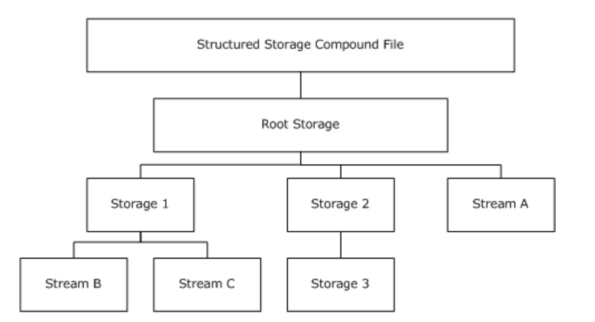

# Compound Binary File Format C library


### Overview

A Compound File is made up of a number of virtual streams. These are collections of data that behave as a linear stream, although their on-disk format may be fragmented. Virtual streams can be user data, or they can be control structures used to maintain the file. Note that the file itself can also be considered a virtual stream.



All allocations of space within a Compound File are done in units called sectors. The size of a sector is definable at creation time of a Compound File, but for the purposes of this document will be 512 bytes. A virtual stream is made up of a sequence of sectors.
The Compound File uses several different types of sector: Fat, Directory, Minifat, DIF, and Storage. A separate type of 'sector' is a Header, the primary difference being that a Header is always 512 bytes long (regardless of the sector size of the rest of the file) and is always located at offset zero (0). With the exception of the header, sectors of any type can be placed anywhere within the file. 
The CFB is used in MS Office .doc, .xls, .ppt files.

### cfb.h 
Header only library to read CFB file and get streams.
```c
	#include "cfb.h"
	
	int main(int argc, char *argv[]){
		struct cfb cfb;
		if(cfb_open(&cfb, "1.doc") == 0){
			FILE *summary = cfb_get_stream(&cfb, "\005SummaryInformation");
			
			// do your magic with file
			
			fclose(summary);
			cfb_close(&cfb);
		}
	}
	
```

### property_set.h 
Header only library to MS Property Set file and get list of properties.
```c
	#include "property_set.h"
	
	int prop_cb(void * user_data, uint32_t propid, uint32_t dwType, uint8_t * value){
		char * str = NULL;
		
		if (dwType == 30){
			char buf[BUFSIZ];
			strncpy(buf, (char*)value + 4, BUFSIZ);
			str = buf;
		}
		else if (dwType == 2){
			char buf[10];
			sprintf(buf, "%d", *(uint16_t*)value);
			str = buf;
		}
		else if (dwType == 3){
			char buf[10];
			sprintf(buf, "%d", *(uint32_t*)value);
			str = buf;
		}

		printf("PROP id: %d, type: %d, value: %s\n", propid, dwType, str);
		return 0;
	}
	
	int main(int argc, char *argv[]){
			FILE *summary; // File stream with property set list
			
			property_set_get(summary, NULL, prop_cb);
		}
	}
	
```
